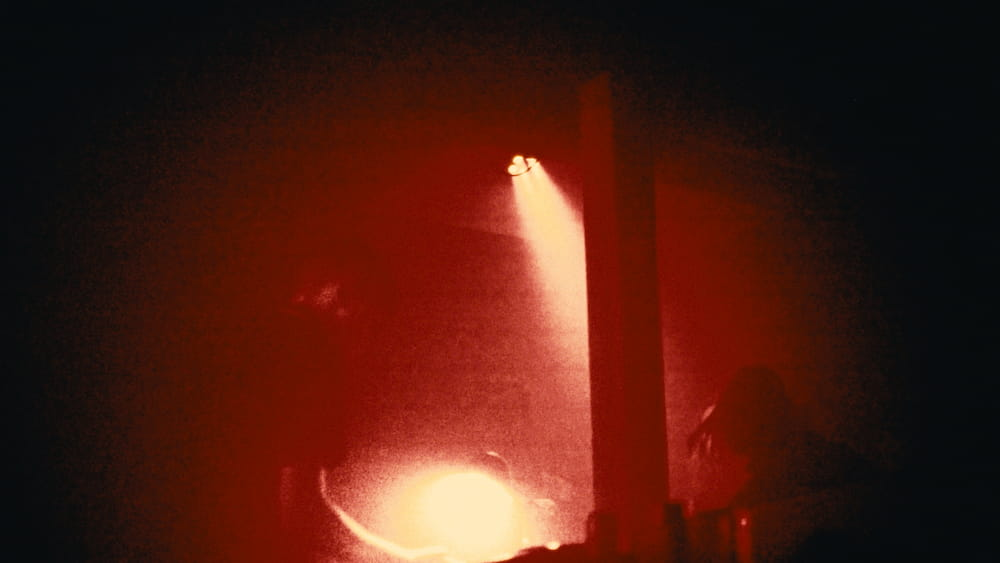
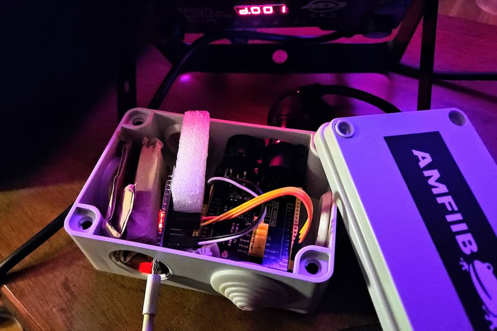

# SparkWeaver Core

Node-based lighting system for controlling DMX fixtures.



### Motivation

Created to run simple lighting setups using only a ESP32 hooked directly to DMX. The core library contains no platform-specific code, see below for implementations.

---

## Web interface

For editing and simulating node trees, see [SparkWeaver Web](https://github.com/rzuppur/sparkweaver.web) UI. It provides an easy editor to create node trees and visualize them using WebAssembly to run this core library.


---

## Running on a microcontroller

To send DMX signals from an ESP32, see [SparkWeaver ESP](https://github.com/rzuppur/sparkweaver.esp) for a complete project compatible with SparkWeaver Web bluetooth interface. You need to connect a DMX board or build your own.



---

## Development

### Node name prefixes

All nodes extend a common Node class and configure the allowed combination of inputs, triggers and parameters. This naming convention should be followed.

- `ds` **Destination** (output color to fixture)
- `fx` **Effect** (modifies color somehow)
- `mx` **Mix** (combine multiple colors)
- `sr` **Source** (input color)
- `tr` **Trigger** (send or modify trigger signals)

### Principles

- Node tree must be a directed acyclic graph.
- Nodes run in ticks evaluated from the destination node.
- Nodes must evaluate all inputs at every tick (otherwise delays would break, for example). Node output may be requested multiple times in a single tick.
- Tick length is not defined but assumed to be around 24 ms, the time it takes to send one full 512-byte DMX packet. That's about 42 FPS. You can have faster updates by sending less than 512 bytes.

### Node tree format

First byte is version followed by node command bytes and parameters, if any. After nodes are links between nodes.

Node parameters are little-endian uint16. All parameters are required.

### Example

Creates a orange `#FF8040` color input node and connects its color output to a DMX fixture at address 50.

```bash
03    # version

00    # first node (DMX output)
32 00 #   first parameter (address, 50)

60    # second node (Color)
FF 00 #   first parameter (red, FF)
80 00 #   second parameter (green, 80)
40 00 #   third parameter (blue, 40)

FE    # color links
01 00 #   count (1)
      # color link 1
01 00 #   output node index (1, Color)
00 00 #   input node index (0, DMX)
00    #   output index (0)
00    #   input index (0)

FF    # trigger links
00 00 #   count (0)
```

---

## License

MIT License

SparkWeaver Copyright (c) 2025 Reino Zuppur

Permission is hereby granted, free of charge, to any person obtaining a copy
of this software and associated documentation files (the "Software"), to deal
in the Software without restriction, including without limitation the rights
to use, copy, modify, merge, publish, distribute, sublicense, and/or sell
copies of the Software, and to permit persons to whom the Software is
furnished to do so, subject to the following conditions:

The above copyright notice and this permission notice shall be included in all
copies or substantial portions of the Software.

THE SOFTWARE IS PROVIDED "AS IS", WITHOUT WARRANTY OF ANY KIND, EXPRESS OR
IMPLIED, INCLUDING BUT NOT LIMITED TO THE WARRANTIES OF MERCHANTABILITY,
FITNESS FOR A PARTICULAR PURPOSE AND NONINFRINGEMENT. IN NO EVENT SHALL THE
AUTHORS OR COPYRIGHT HOLDERS BE LIABLE FOR ANY CLAIM, DAMAGES OR OTHER
LIABILITY, WHETHER IN AN ACTION OF CONTRACT, TORT OR OTHERWISE, ARISING FROM,
OUT OF OR IN CONNECTION WITH THE SOFTWARE OR THE USE OR OTHER DEALINGS IN THE
SOFTWARE.
