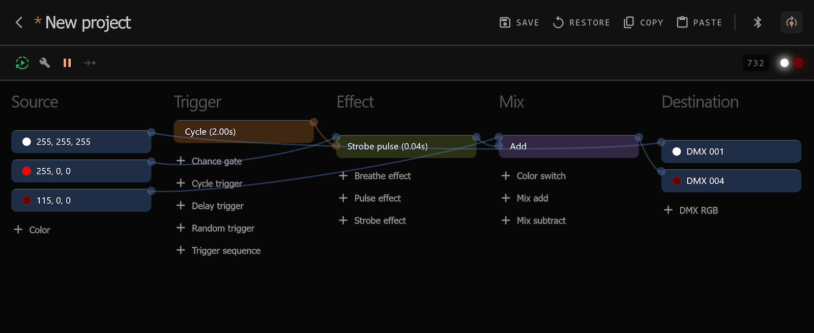

# SparkWeaver Core

Node-based lighting system for controlling DMX fixtures.

### Motivation

Created to run simple lighting setups using only a ESP32 hooked directly to DMX. The core library contains no platform-specific code, see below for implementations.

---

## Web interface

For editing and simulating node trees, see [SparkWeaver Web](https://github.com/rzuppur/sparkweaver.web) UI. It provides easy editor to create node trees and visualize them using WebAssembly to run this core library.



---

## Running on a microcontroller

To send DMX signals from an ESP32, Arduino or similar microcontroller, you need a DMX shield or build your own using a chip like the MAX485. Inexpensive DMX shields with XLR connectors already attached are the easiest option. There isn’t one definitive guide to recommend, so please search the web to find more info relevant to your use case.

### Incomplete example of SparkWeaver on an ESP32

```c++
#include <esp_dmx.h>
#include <SparkWeaverCore.h>

SparkWeaverCore::Builder builder;

void setup() {
    Serial.begin(SERIAL_MONITOR_SPEED);
    constexpr auto config = DMX_CONFIG_DEFAULT;
    dmx_driver_install(DMX_UART_PORT, &config, {}, 0);
    dmx_set_pin(DMX_UART_PORT, TX_PIN, RX_PIN, ENABLE_PIN);
    
    try {
        builder.build("SrColor 0 0 0\n etc..."); // Load your tree here
    } catch (const std::exception& e) {
        Serial.println(e.what());
    }
}

void loop()
{
    dmx_write(DMX_UART_PORT, builder.tick(), DMX_PACKET_SIZE);
    dmx_send(DMX_UART_PORT);
    dmx_wait_sent(DMX_UART_PORT, DMX_TIMEOUT_TICK);
}

```

---

## Development

### Node name prefixes

All nodes extend a common Node class and configure the allowed combination of inputs, triggers and parameters. This naming convention should be followed.

- `ds` **Destination** (output color to fixture)
- `fx` **Effect** (modifies color somehow)
- `mx` **Mix** (combine multiple colors)
- `sr` **Source** (input color)
- `tr` **Trigger** (send or modify trigger signals)

### Principles

- Node tree must be a directed acyclic graph.
- Nodes run in ticks evaluated from the destination node.
- Nodes must evaluate all inputs at every tick. **_Skipping ticks breaks delays!_**
- Tick length is not defined but assumed to be around 24ms, the time it takes to send one full 512 byte DMX packet. That's about 42 FPS. You can have faster updates by sending less than 512 bytes.

### Tree format

Each line is a single command. Commands can have 0-`NODE_PARAMS_MAX` parameters separated by a space.

```
COMMAND_A Param1 Param2 Param3
COMMAND_B Param1
COMMAND_C
```

Commands are either node names (SrColor, MxAdd, etc.) or a connection from one node to another. Nodes are zero-indexed starting from the top.

Parameters must be unsigned 16-bit integers.

### Connection commands

#### **`C FROM_INDEX TO_INDEX`** color connection

Colors are eight bit RGB values.

#### **`T FROM_INDEX TO_INDEX`** trigger connection

Triggers are boolean signals, can be used to trigger effects.

### Example

Creates a red (255 0 0) color input node (index 0), connects its color output to DMX fixture (index 1) at address 50.

```
SrColor 255 0 0
DsDmxRgb 50
C 0 1
```

---

## License

SparkWeaver Copyright (c) 2025 Reino Zuppur

Permission is hereby granted, free of charge, to any person obtaining a copy
of this software and associated documentation files (the "Software"), to deal
in the Software without restriction, including without limitation the rights
to use, copy, modify, merge, publish, distribute, sublicense, and/or sell
copies of the Software, and to permit persons to whom the Software is
furnished to do so, subject to the following conditions:

The above copyright notice and this permission notice shall be included in all
copies or substantial portions of the Software.

THE SOFTWARE IS PROVIDED "AS IS", WITHOUT WARRANTY OF ANY KIND, EXPRESS OR
IMPLIED, INCLUDING BUT NOT LIMITED TO THE WARRANTIES OF MERCHANTABILITY,
FITNESS FOR A PARTICULAR PURPOSE AND NONINFRINGEMENT. IN NO EVENT SHALL THE
AUTHORS OR COPYRIGHT HOLDERS BE LIABLE FOR ANY CLAIM, DAMAGES OR OTHER
LIABILITY, WHETHER IN AN ACTION OF CONTRACT, TORT OR OTHERWISE, ARISING FROM,
OUT OF OR IN CONNECTION WITH THE SOFTWARE OR THE USE OR OTHER DEALINGS IN THE
SOFTWARE.
